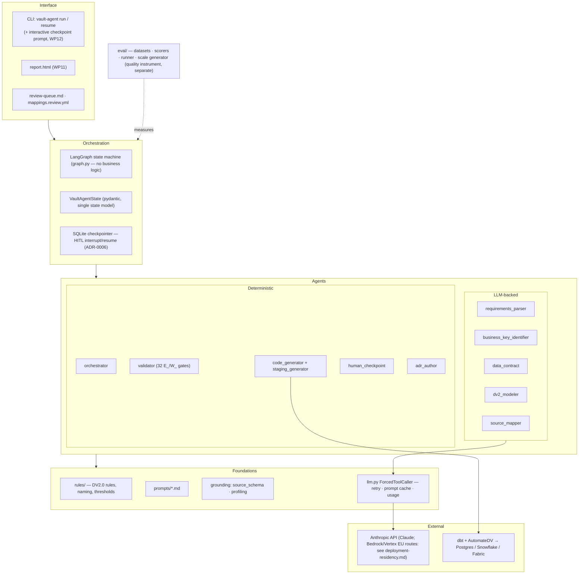
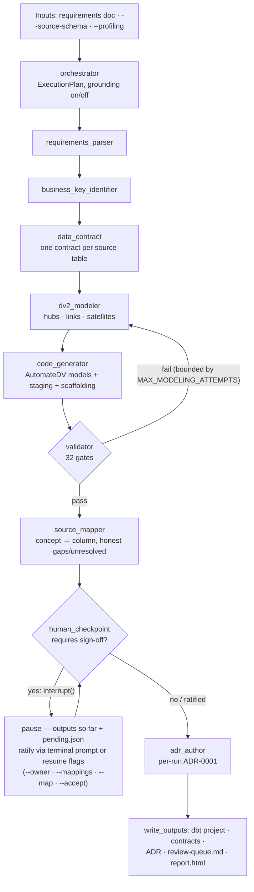

# Architecture diagrams

Two views, maintained by hand alongside the code: the component/layer architecture and a
standard (grounded) processing run. Update when the graph topology or a layer changes —
last verified against `graph.py` / CLAUDE.md milestones 2026-07-19.

## Components / layers

## Standard run (grounded)

Notes: the re-model loop feeds only `severity=error` issues back (WP3); the mapper runs
post-validation and re-binds staging itself (WP9 §4 note); the checkpoint node stays
pure before `interrupt()` because it re-executes on resume (ADR-0006).
