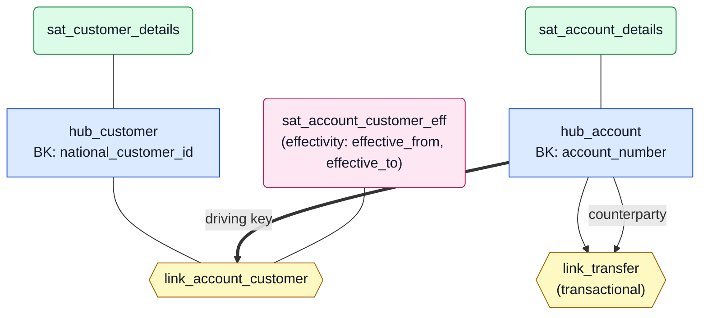
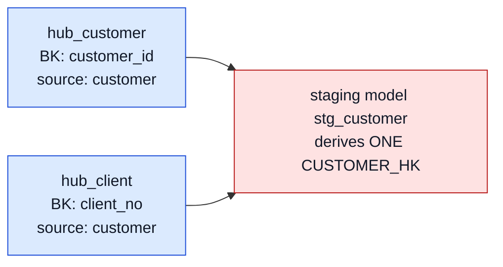

# 2. Concepts & terminology

## 2.1 Data Vault 2.0 in five minutes

Data Vault separates *what identifies* a business object from *what describes* it and
from *how objects relate*. A **hub** holds exactly one business concept, identified by
its **business key** — the stable, business-recognised natural identifier (an account
number, a national customer id), never a system surrogate. A **link** records a
relationship between two or more hubs and nothing else. A **satellite** hangs off one
hub or link and carries the descriptive, changing attributes — historised, so every
state the source ever showed is preserved.

Rows are identified by **hash keys** computed from the business keys (a hub's `X_HK`,
a link's hash over its participants' keys), and satellites detect change through a
**hashdiff** over their payload. Every row carries load metadata (`LOAD_DATETIME`,
`RECORD_SOURCE`). This separation is what buys the properties DACH enterprises adopt
DV for: full auditability (nothing is updated in place), parallel loading (constructs
are independent), and multi-source integration (the same key hashes identically
regardless of which system delivered it).

The canonical rules the pipeline enforces are catalogued in
`docs/methodology/dv2-rules-cheatsheet.md`; this chapter only builds the vocabulary the
rest of the manual needs.

## 2.2 The constructs vault-agent generates

A healthy model as the pipeline produces it (bank demo shape):



Reading aids: thick edge = the link's **driving key** (the participation that stays
fixed while the other rotates — here: an account keeps its identity while ownership
changes). Two edges from the same hub into `link_transfer` = the **same hub
participating twice**; the repeated participation carries a **role**
(`counterparty`), the other stays unqualified.

**Standard satellite.** The default: one row per change of its descriptive payload.
The modeler splits satellites along four axes — rate of change, source system, data
classification, data type — one satellite holds attributes that belong together on all
of them.

**Multi-active satellite.** Several rows are *concurrently* valid per parent (a
customer's addresses), distinguished by a **child dependent key (CDK)** such as
`address_type`. The CDK is a key column, not payload — listing it among the attributes
is the classic mistake shown in 2.4. A multi-active satellite typically has its rows in
their own, finer-grained source relation, declared as the satellite's `source_table`.

**Effectivity satellite.** Tracks a relationship's *active period* with exactly two
date attributes in (start, end) order. It requires the link's **driving key**: when the
non-driving side rotates (account ownership transfers), the superseded relationship is
end-dated to the successor's business date — the defining behaviour, demonstrated in
9.4.

**Standard link vs. transactional link.** A standard link records that a relationship
exists; history lives in its satellites. A transactional link (AutomateDV `t_link`)
records atomic business events (transfers, payments) — one row per event, no updates.
Either way, a link represents exactly one **unit of work**: the keys of one atomic
business event, never several relationships merged or one event split.

**Role-qualified participation.** When one hub participates twice in the same link (a
transfer's paying account and its counterparty are both accounts), the repeated
participation carries a role — the other may stay unqualified — and the role-qualified
column is prefixed accordingly (`COUNTERPARTY_ACCOUNT_HK` next to `ACCOUNT_HK`). A
driving key may name a role as `hub_account:counterparty`.

**Multi-source hub.** One business key living in several source systems (the WP10
integration case: a partner in the legacy system *and* the CRM) becomes ONE hub fed by
per-source staging, each aliasing its physical key column to a canonical name so the
same key value hashes identically across feeds — one hub row per key, satellites split
per source. The canonical name is the source's own column name unless the feeds
disagree, in which case the business term wins (no gratuitous renames).

## 2.3 Pipeline vocabulary

**Grounding** — declaring a source schema (`--source-schema`) so the pipeline works
against real columns: proposed keys and attributes are checked against the declared
tables, prompts steer the LLM agents to real column names, and staging binds to the
declared relations. Without it the pipeline still runs, but bindings are inferred and
flagged. **Profiling** evidence (`--profiling`) adds per-column statistics the source
mapper uses — with the caveat baked into its prompt: statistics establish structure,
never intent.

**Business↔source mapping** — the mapper's proposal, per model concept (hub key,
satellite attribute), of which physical column feeds it, each with a confidence
category (`exact_name` > `comment_grounded` > `profiled_key` > `llm_semantic`), or an
honest **gap** (no in-scope source) / **unresolved** (needs your decision). Proposals
become binding only through **ratification** — your checkpoint decision (chapter 7.6).

**Data contract** — a JSON-Schema-based description of one source asset (types,
nullability, failure modes, owner) drafted per source table, with dbt schema tests
derived from it. A contract with a placeholder owner blocks finalization until a human
assigns one.

**Flag** — the pipeline's typed signal channel: each flag names its producing agent,
severity (error/advisory), kind, and the affected asset. Flags feed the **review
queue**, the categorized, blocking-first list a human answers at the checkpoint.
Advisory flags inform; they never block.

**Gate** — one deterministic validator check with a stable `E_`/`W_` code (chapter 8).
**Backstop** — a deterministic pre-gate repair of a known LLM mistake (10.4).
**Steering rule** — a registered prompt rule the modeler receives; backstops and
steering are model-compensation and re-tested per model release (11.4), gates are not.

## 2.4 Error constellations by example

The validator (chapter 8) blocks structurally broken models before generation. Three
instructive constellations:

**CDK listed as payload → `E_SAT_DUP_ATTR`.** A multi-active satellite's child
dependent key and its attributes share one column namespace:

```yaml
# ✗ rejected: address_type would be emitted twice (src_cdk AND src_payload)
satellite: sat_insured_person_address     # multi_active
child_dependent_key: [address_type]
attributes: [address_type, street, city, postal_code]

# ✓ correct: the CDK column ships via src_cdk regardless
child_dependent_key: [address_type]
attributes: [street, city, postal_code]
```

(The modeler carries a deterministic backstop for exactly this mistake — see 10.4.)

**Reversed date pair → `E_EFFSAT_DATE_ORDER`.** An effectivity satellite's two date
attributes are read positionally as (start, end):

```yaml
# ✗ rejected: recognisably reversed — generation would swap active-from/active-to
satellite: eff_sat_account_customer       # effectivity
attributes: [valid_to, valid_from]

# ✓ correct order
attributes: [valid_from, valid_to]
```

**Two hubs, same source entity, different keys → `E_HUB_HK_COLLISION`.**



Both hubs would derive their hash key from the same staging model — one hub's key
silently binds to the other's business key. The validator blocks this before any SQL
exists. (The sibling case — same BK *and* same source on two hubs — is the same concept
modelled twice, `E_DUP_HUB`.)

These three are errors because the break is *provable* from the model alone. Contrast
the advisory side: when a *standard* satellite hangs off a link and carries a
from/to date pair, it is *probably* a mis-modelled effectivity satellite — but only
probably, so the validator emits `W_SAT_MAYBE_EFFECTIVITY` and lets the human decide.
That asymmetry — provable breaks fail, heuristic matches warn — runs through the whole
gate catalogue.
