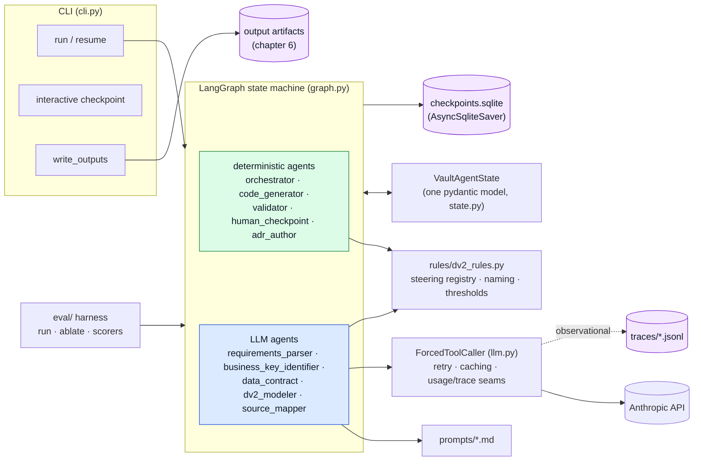
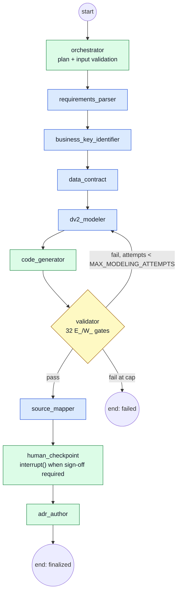

# 3. Architecture

## 3.1 Component overview

The pipeline is ten agents wired into one LangGraph state machine, and the split that
matters operationally is **deterministic vs. LLM**. Five agents call a model
(requirements_parser, business_key_identifier, data_contract, dv2_modeler,
source_mapper); five are pure code (orchestrator, code_generator, validator,
human_checkpoint, adr_author). Everything that decides whether an output is *acceptable*
— validation, code generation, the review queue — is deterministic and therefore
reproducible: the same model in produces the same SQL and the same verdicts out,
byte-identically. LLM output is never trusted directly; it is always validated,
and where it exhibits a known failure mode, repaired by a named backstop first (10.4).

Three supporting pieces keep this honest. The **rules module**
(`rules/dv2_rules.py`) is the single source of truth for DV knowledge — modeling rules
(as a registry of steering rules with ids), naming conventions, thresholds; agents and
prompts import from it, never restate it. **Prompts** are Markdown files loaded at
runtime, so what an LLM agent was told is inspectable and versioned. And every LLM call
funnels through one chokepoint, the **ForcedToolCaller**: it forces a single typed tool
response, retries transient API failures with backoff, raises on truncation instead of
returning partial payloads, caches the system prompt across retries, and carries two
purely observational seams — usage recording (token counts) and trace recording
(chapter 10) — that never influence the call itself.

## 3.2 Pipeline topology

Two placement decisions look odd at first and are deliberate. The **data_contract**
agent runs *before* modeling: contracts describe source-to-staging assets, so they
depend only on the requirements, business keys, and declared schema — never on the DV
model. Placed there, the validation re-model loop (which routes back to dv2_modeler)
can iterate without ever re-drafting contracts. The **source_mapper** runs *after* the
validator: the validator checks the code generator's artifacts, so generation cannot
move behind it — the mapper therefore maps against the stable, validated model and
re-binds the staging layer itself when a mapping is ratified.

The **re-model loop** is the pipeline's self-correction: a failing validation routes
back to the modeler with only the *errors* as feedback (warnings are for humans, not
steering), each reduced to code/construct/message. The loop is bounded by
`MAX_MODELING_ATTEMPTS` (3); at the cap the run ends as failed, with the artifacts so
far, the report, and the review queue on disk for diagnosis. The system prompt is
byte-identical across attempts, so retries hit the prompt cache and cost mainly output
tokens.

## 3.3 State & persistence

All pipeline state is **one typed pydantic model** (`VaultAgentState`); each agent
reads and writes declared fields, and everything an agent wants a human or a later
agent to know travels as state — typed flags (never string matching), a decisions
audit log, typed validation issues, the mapping proposal set. There is no hidden
context: if it is not in the state, it did not happen.

State persists through a **LangGraph SQLite checkpointer** under the output directory
(`.vault-agent/checkpoints.sqlite`), one thread per run. This is what makes the HITL
pause real: at the checkpoint the graph calls `interrupt()`, the CLI writes the
artifacts-so-far plus `pending.json`, and the process may exit entirely — `resume`
reattaches to the same thread, possibly days later, from another shell. Everything
before the interrupt is pure/idempotent because the node re-executes on resume. A
finalized run prunes its checkpoint thread; a paused one keeps it.

The design passes the three-files test from the harness literature the project cites
(LOOPS.md rule IV): a crashed or paused run is fully described by its plan
(`ExecutionPlan` in state), its review queue, and `pending.json` — all on disk.

## 3.4 Where things live

| Path | Contents |
|------|----------|
| `src/vault_agent/agents/` | One agent per file |
| `src/vault_agent/rules/dv2_rules.py` | DV rules, steering registry, naming — single source of truth |
| `src/vault_agent/prompts/` | LLM agent prompts (Markdown, loaded at runtime) |
| `src/vault_agent/{graph,state,llm,cli}.py` | Topology · typed state · LLM chokepoint · CLI and output writing |
| `demo/` | Re-runnable, no-API-key Postgres end-to-end demos (9.5) |
| `eval/` | Eval harness: datasets, scorers, runner, ablation (chapter 11) |
| `docs/` | Architecture specs & ADRs, methodology notes, demos, this manual |
| `tests/` | Keyless test suite (LLM calls injectable/stubbed) |

The anatomy of an *output* directory is chapter 6.4.
