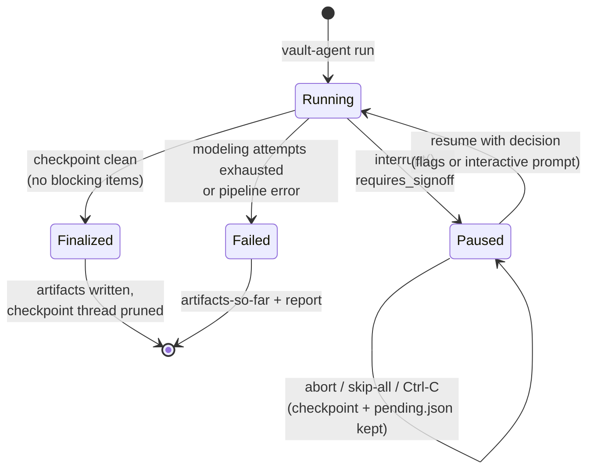

# 7. The HITL checkpoint

## 7.1 Why the pipeline pauses

The checkpoint is where assist-not-decide becomes mechanical. Two things — and only
these two — **block** finalization (`requires_signoff`): a validation *error* that
survived the re-model loop, and a data contract whose owner is still the placeholder
(nobody accountable for a source asset). Everything else in the review queue —
validation warnings, mapping gaps, inferred staging bindings, truncation notices — is
**advisory**: the pipeline tells you honestly what it could not determine and proceeds
once you sign off. A mapping gap, in particular, is not a defect; it is the mapper
refusing to force-fit a source onto a concept that has none (often correctly pointing
at Business Vault scope).

## 7.2 Run lifecycle



A pause is durable: the graph state is checkpointed to disk, the process can exit, and
`resume` reattaches to the same thread whenever you are ready. Aborting an interactive
session never loses anything — `pending.json` and the checkpoint survive every path
except successful finalization.

## 7.3 Reading the review queue

The queue appears in three places, always with identical content: the console at pause
time, `review-queue.md`, and the report's review section. It is ordered
**blocking-first** — validation errors and unassigned owners at the top, then
validation warnings, then advisory flags. Repetitive advisories (more than 3 of the
same kind, e.g. 38 undetermined contract-field types) collapse into one summarised
line with samples; the displayed item *count* still reflects the underlying items, so
a count higher than the visible lines is aggregation, not loss.

Judge the queue top-down: blocking items need a decision, warnings deserve a look
(chapter 8 explains each code), and the collapsed advisory block at the bottom is
usually confirmation of known input gaps (no declared schema, placeholder owners)
rather than news.

## 7.4 Answering interactively

In a terminal, the checkpoint answers itself in place: a paused `run` (or a flag-less
`resume`) walks the actionable items — prompting a name/email for each unassigned
contract owner and a `TABLE.COLUMN` for each single-source unresolved mapping — then
asks for the accept confirmation and finalizes in-process. Malformed answers re-prompt;
skipping an item leaves it for a later resume.

Two deliberate limits. The prompt offers exactly what the resume flags offer — nothing
more — so anything you can do interactively is scriptable, and vice versa
(capability parity; the outputs are byte-identical between the two paths). And
**multi-source keys are never prompted**: a key whose candidates span two source
systems is listed with a pointer to `resume --mappings`, because that decision needs
the full evidence in front of you, not a one-line answer. Auto-detection: interactive
only when stdin and stdout are TTYs; `--interactive`/`--no-interactive` overrides.

## 7.5 Answering with flags

```bash
vault-agent resume --owner "customer=Jane Doe <jane@bank.example>" \
                   --owner "account=BI Team <bi@bank.example>" \
                   --map "partner number=VICTOR_PARTNER.PARTN_NR" \
                   --accept
```

| Flag | Repeatable | Effect |
|------|-----------|--------|
| `--owner "asset=Name <email>"` | yes | Assigns the contract owner; prunes exactly that asset's owner flag |
| `--map "concept=TABLE.COLUMN"` | yes | Ratifies/overrides one mapping |
| `--mappings <file>` | no | Ratifies an edited `mappings.review.yml` wholesale |
| `--accept` | — | Signs off and proceeds past the checkpoint |

`apply_human_decision` performs the commit: owners are written onto the contracts,
ratified mappings promote their concepts (and re-bind the staging layer to the real
source tables, clearing the inferred-binding flags), and each resolved item's flag is
pruned by exact asset match. The ADR author then finalizes with your decisions in the
trail.

## 7.6 Ratifying business↔source mappings

`mappings.review.yml` is the round-trip file. Each proposal carries concept, table,
column, a confidence **category** — `exact_name` (the column literally matches),
`comment_grounded` (the deciding signal was a source comment, quoted in evidence),
`profiled_key` (structural: uniqueness/null profile), `llm_semantic` (judgment call) —
and its evidence list. Review descending: `exact_name` needs a glance, `llm_semantic`
deserves scrutiny. `gaps` are concepts with no in-scope source (leave them — they are
the honest output); `unresolved` need your decision.

To ratify: edit table/column where the proposal is wrong, move an `unresolved` concept
up into `proposals` with its source, then `resume --mappings <file>`. A genuinely
multi-source key (the same business key anchored in two systems' entity tables) uses
the `sources:` form instead — listing one (table, column) per feed — which turns the
hub into a multi-source hub (2.2) on the next generation. Watch for the one trap the
categories cannot catch for you: a technical GUID can profile perfectly
(`profiled_key`) and still not be the business key the requirements mean — the mapper
is prompted to resist this, but the ratification is where it is decided.
