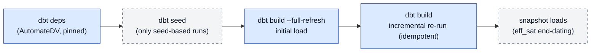

# 9. From output to warehouse

## 9.1 The generated project

A finalized run's output directory *is* a dbt project: models (staging + raw vault),
`dbt_project.yml` (staging as views, raw vault incremental, seeds unquoted),
`packages.yml` (AutomateDV, pinned), and a generated `README.md` documenting how to run
exactly this output. You supply two things: the **raw data** — either as dbt seeds
(CSVs matching the expected columns documented in `models/staging/sources.yml`) or as
real tables when the run was grounded with physical locations — and a
**`profiles.yml`** with your warehouse connection.

## 9.2 Build workflow

`dbt build --full-refresh` is the canonical first command: it seeds (where
applicable), builds staging and raw vault, and runs the generated tests in one pass.
The acceptance signal that matters operationally is the **incremental re-run**: a
second plain `dbt build` must be idempotent — no duplicate rows, no changed end-dates.
If a re-run changes row counts, something is wrong (usually staging binding or key
hashing), regardless of how green the first build was. PASS counts vary with the
model; the demos' READMEs record their expected values as dated reference points.

## 9.3 Source binding forms

How a staging model references its raw relation tells you how much the run knew about
your sources — recognisable in `models/staging/*.sql` and `sources.yml`:

**Inferred** (`raw_<base>`): no declared source table matched, so the generator named
the conventional relation and flagged it (`SOURCE_BINDING`, advisory). Seed-based
builds use this form; the flag is your review prompt, never a silent guess.

**Declared, bare-name**: a grounded run matched a declared table *without*
schema/database — the staging references the table name directly and `sources.yml`
documents the expected raw interface. This deliberately keeps the seed-compatible
pattern (a dbt source without a schema property would default its schema to the
source name and break it).

**`source()` mapping form**: the declared table carried `schema`/`database`, so
staging binds via dbt's `source()` and `sources.yml` becomes a real source definition
(one block per distinct database/schema). No seeds involved — dbt reads your actual
raw tables. Ratifying mappings at the checkpoint (7.6) upgrades bindings to this form
and clears the inferred-binding flags.

## 9.4 Incremental behaviour & effectivity end-dating

The generated effectivity satellite closes superseded relationships: AutomateDV's
auto-end-dating is enabled, driven by a dedicated `APPLIED_DTS` column that staging
derives from the business start date — so a superseded row is closed to the
*successor's business date*, not to a load timestamp. The bank demo's Phase B2 shows
the canonical two-batch pattern: after loading a transfer snapshot, the account's
first ownership row is end-dated to the new owner's start (2026-04-01) and the new row
stays open — and stays that way on re-runs.

Multi-active satellites read their own finer-grained staging (their declared
`source_table`), with the parent's hash key joining every row back to the hub.
Multi-source hubs union their per-source staging models into one hub — the same key
value produces an *identical* hash key in every feed's stage and in the hub, which is
the property to spot-check after a first multi-source build (one row per key,
satellites split by record source).

## 9.5 The demos as reference runs

Both demos build a real Postgres vault **without an API key** (deterministic build
scripts through the real code generator) and serve as regression anchors — re-run them
after any upgrade (AutomateDV bump, dbt bump, generator change):

`demo/bank_postgres/` — the ungrounded baseline: seed-based, inferred bindings,
hand-authored staging for the two-phase end-dating demo, self-referencing transfer
link with role-qualified FKs. Its README's runbook and Findings section double as a
worked example of everything in 9.2–9.4.

`demo/mapping_postgres/` — the grounded contrast: declared enriched schema plus a
ratified mapping, staging bound to real business-named tables, **zero**
inferred-binding flags. Same model, different knowledge — comparing the two staging
layers side by side is the fastest way to internalise 9.3.

## 9.6 Platform notes

Verified end-to-end on **PostgreSQL 16** with the pinned AutomateDV version; the
Postgres-specific convention worth knowing is casing — every identifier stays
*unquoted* (seeds set `quote_columns: false`), so UPPER_SNAKE names fold consistently.
Snowflake, BigQuery, Databricks, and MS SQL Server are supported by the AutomateDV
backend but not covered by the project's own verification; on a first build there,
treat the demo checklist (build green, incremental idempotent, end-dating closes) as
the acceptance test and expect platform-specific casing/quoting to be the first thing
to check.
