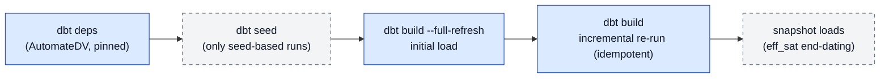

# 9. From output to warehouse

## 9.1 The generated project

A finalized run's output directory *is* a dbt project: models (staging + raw vault),
`dbt_project.yml` (staging as views, raw vault incremental, seeds unquoted),
`packages.yml` (AutomateDV, pinned), and a generated `README.md` documenting how to run
exactly this output. You supply two things: the **raw data** — either as dbt seeds
(CSVs matching the expected columns documented in `models/staging/sources.yml`) or as
real tables when the run was grounded with physical locations — and a
**`profiles.yml`** with your warehouse connection.

## 9.2 Build workflow

`dbt build --full-refresh` is the canonical first command: it seeds (where
applicable), builds staging and raw vault, and runs the generated tests in one pass.
The acceptance signal that matters operationally is the **incremental re-run**: a
second plain `dbt build` must be idempotent — no duplicate rows, no changed end-dates.
If a re-run changes row counts, something is wrong (usually staging binding or key
hashing), regardless of how green the first build was. PASS counts vary with the
model; the demos' READMEs record their expected values as dated reference points.

## 9.3 Source binding forms

How a staging model references its raw relation tells you how much the run knew about
your sources — recognisable in `models/staging/*.sql` and `sources.yml`:

**Inferred** (`raw_<base>`): no declared source table matched, so the generator named
the conventional relation and flagged it (`SOURCE_BINDING`, advisory). Seed-based
builds use this form; the flag is your review prompt, never a silent guess.

**Declared, bare-name**: a grounded run matched a declared table *without*
schema/database — the staging references the table name directly and `sources.yml`
documents the expected raw interface. This deliberately keeps the seed-compatible
pattern (a dbt source without a schema property would default its schema to the
source name and break it).

**`source()` mapping form**: the declared table carried `schema`/`database`, so
staging binds via dbt's `source()` and `sources.yml` becomes a real source definition
(one block per distinct database/schema). No seeds involved — dbt reads your actual
raw tables. Ratifying mappings at the checkpoint (7.6) upgrades bindings to this form
and clears the inferred-binding flags.

**Translation model** (WP36, ADR-0013): a link ratified from a foreign key that references a
surrogate while the hub is keyed on the natural key gets a second staging model,
`stg_<link>_via_<relation>` — a view that LEFT JOINs the referencing relation to the
referenced one on the surrogate and projects the natural key under the hub's canonical
column name. The link's ordinary `stage` model reads that view instead of the raw relation;
its hashes are unchanged. Every row of the referencing relation survives the join; an
unmatched surrogate becomes a NULL key that the model's own `schema.yml` refuses at
`dbt build` (`not_null` on the projected key, `relationships` from the surrogate to the
referenced relation). The translation is therefore visible SQL and a failing test, never a
hidden mapping. `metadata/automatedv.yml` records it under the link's staging entry as
`key_translation`, one entry per join. Since WP39 the join may go one table further than the relation the foreign key names — when that relation has no hub and its key is itself a declared foreign key — and the view is still one LEFT JOIN, to the end table. **Built on PostgreSQL since 2026-09-13** (`demo/fk_links_postgres`); that first build fixed the view's `schema.yml` (not valid YAML before) and the case of two translations in one link (one view, one LEFT JOIN each, `_via_<a>_and_<b>`).

**Relationship-table link** (WP37): a link ratified for a whole table (`Table.*`, 7.5) is
named `link_<table>` and its stage binds to *that* table — the one relation that carries every
participation's key — through the same override path a ratified mapping uses, so no
`SOURCE_BINDING` flag is raised for it. Translated participations read their translation
views as above. Built on PostgreSQL in the same demo since 2026-09-13.

**Subtype feed** (WP38): a satellite on a hub keyed on the natural key, read from a table keyed
on the supertype's surrogate — `sat_sales_person_details` on `hub_employee` from `SalesPerson` —
has its dedicated stage read `stg_<satellite>_via_<relation>`: the same translation view and the
same data-time tests. It arises only from a ratified same-as whose join the schema declares
(7.5). Since WP39 also a table keyed on the subtype's key (`SalesPersonQuotaHistory`). Built on
PostgreSQL since 2026-09-14 (`demo/fk_links_postgres`).

**Key-license repair** (WP40): a link or satellite the modeler built from a relation that lacks a
participation's key gets that participation's translation, or alias, from a ratified key license
or link proposal. The link's stage and a link satellite's stage then read one view with one LEFT
JOIN per translated participation (`stg_product_inventory_via_product_and_location`). Nothing is
built that the modeler did not build. Built on PostgreSQL since 2026-09-15.

## 9.4 Incremental behaviour & effectivity end-dating

The generated effectivity satellite closes superseded relationships: AutomateDV's
auto-end-dating is enabled, driven by a dedicated `APPLIED_DTS` column that staging
derives from the business start date — so a superseded row is closed to the
*successor's business date*, not to a load timestamp. The bank demo's Phase B2 shows
the canonical two-batch pattern: after loading a transfer snapshot, the account's
first ownership row is end-dated to the new owner's start (2026-04-01) and the new row
stays open — and stays that way on re-runs.

Multi-active satellites read their own finer-grained staging (their declared
`source_table`), with the parent's hash key joining every row back to the hub.
Multi-source hubs union their per-source staging models into one hub — the same key
value produces an *identical* hash key in every feed's stage and in the hub, which is
the property to spot-check after a first multi-source build (one row per key,
satellites split by record source).

## 9.5 The demos as reference runs

All three demos build a real Postgres vault **without an API key** (deterministic build
scripts through the real code generator) and serve as regression anchors — re-run them
after any upgrade (AutomateDV bump, dbt bump, generator change):

`demo/bank_postgres/` — the ungrounded baseline: seed-based, inferred bindings,
hand-authored staging for the two-phase end-dating demo, self-referencing transfer
link with role-qualified FKs. Its README's runbook and Findings section double as a
worked example of everything in 9.2–9.4.

`demo/mapping_postgres/` — the grounded contrast: declared enriched schema plus a
ratified mapping, staging bound to real business-named tables, **zero**
inferred-binding flags. Same model, different knowledge — comparing the two staging
layers side by side is the fastest way to internalise 9.3.

`demo/fk_links_postgres/` — the FK-derived links: a surrogate→natural-key translation
(WP36, ADR-0013) and a three-way relationship-table link with two translated
participations (WP37), proposed from declared foreign keys, ratified, applied and
generated by the pipeline's own functions. Its translation views carry the `not_null` /
`relationships` tests that are the data-time gate; its README shows the gate failing on
an orphan surrogate.

## 9.6 Platform notes

The vault SQL is platform-neutral: every physical difference is AutomateDV's, dispatched
per adapter inside the package. What the generator itself knows per platform is the seed
column types it writes when a contract pins a staging source's types (WP7), and the
profile hint in the generated README. That knowledge lives in one place,
`rules/platforms.py`; `--target-platform` (6.2) selects it, and the choice is persisted
with the run so a resume keeps it.

**PostgreSQL** — the default, and the only platform **verified end-to-end** (PostgreSQL 16,
pinned AutomateDV, both demos in 9.5). The convention worth knowing is casing — every
identifier stays *unquoted* (seeds set `quote_columns: false`), so UPPER_SNAKE names fold
consistently.

**Databricks** — selectable since WP35 (2026-09-11), **keyless-only**: no workspace build
has been recorded. Selecting it changes two things — seed types use the native spellings
(`string` instead of `varchar`, which needs a length there; `decimal(38,18)` instead of
`numeric`, whose platform default `DECIMAL(10,0)` would silently truncate fractions) and
the README names the adapter (`dbt-databricks`, `uv sync --extra demo-databricks`) and
the profile shape. Every macro the generated project calls has a Databricks implementation
in the pinned AutomateDV, checked by a test that reads the installed package. On the first
build there, run the demo checklist (build green, incremental idempotent, end-dating
closes) and two Databricks-specific checks: that a plain `dbt build` appends rather than
merges (dbt-databricks defaults to `merge`; without a `unique_key` it should insert every
row — unverified), and that a `number` column loads with its fractions intact, which is
the defect this dialect exists to prevent. The spec's §6 lists the open questions:
`backlog-2026-07/wp35-target-platform-databricks-spec.md`.

**Snowflake, BigQuery, MS SQL Server** — supported by the AutomateDV backend, no profile of
their own yet: they run under the default platform, i.e. with Postgres-spelled seed types,
which those platforms accept. Not covered by the project's own verification; treat the
demo checklist as the acceptance test and expect platform-specific casing/quoting to be
the first thing to check. A profile is added when someone verifies one.
